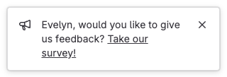



- Tier: Free, Premium, Ultimate
- Offering: GitLab Self-Managed, GitLab Dedicated



GitLab can display two types of broadcast messages to users of a GitLab instance:

- Banners
- Notifications

Broadcast messages can be managed using the [broadcast messages API](../api/broadcast_messages.md).

## Banners

Banners are shown on the top of a page, and optionally in the command line as a Git remote response.


```shell
$ git push
...
remote:
remote: **Welcome to GitLab** :wave:
remote:
...
```

If more than one banner is active at one time, they are displayed at the top of the page in order of
creation. In the command line, only the latest banner is shown.

## Notifications

GitLab shows notifications on the bottom right of a page. They can contain placeholders,
which are replaced with the attributes of the current user:



```markdown
{{name}}, would you like to give us feedback?
<a href="example.com">Take our survey!</a>
```

If more than one notification is active at one time, only the newest is shown.

Notifications support these placeholders:

- `{{email}}`
- `{{name}}`
- `{{user_id}}`
- `{{username}}`
- `{{instance_id}}`

If the user is not signed in, user-related values are empty.

## Add a broadcast message

To display messages to users on your GitLab instance, add a broadcast message.

To add a broadcast message:

1. On the left sidebar, at the bottom, select **Admin**.
1. On the left sidebar, select **Messages**.
1. On the right, select **Add new message**.
1. Add your **Message** text:
   - Message contents can include Markdown, emoji, and the `a` and `br` HTML tags.
   - The `br` tag inserts a line break.
   - The `a` HTML tag accepts `class` and `style` attributes with the following CSS properties:
     - `color`
     - `border`
     - `background`
     - `padding`
     - `margin`
     - `text-decoration`
1. For **Type**, select `banner` or `notification`.
1. Select a **Theme**. The default theme is `indigo`.
1. To enable users to dismiss the broadcast message, select **Dismissable**.
1. Optional. To skip showing the broadcast message in the command line as a Git remote response, select clear the **Git remote responses**.
1. Optional. To show the message only to a subset of users, select **Target broadcast message**:
   - Show to all users on all pages.
   - Show to all users on specific matching pages.
   - Show only to users who have specific roles on groups or project pages. This setting displays your message on
     group, subgroup, and project pages, but does not display in Git remote responses.
1. If required, select the **Target roles** to show the broadcast message to.
1. If required, add a **Target Path** to only show the broadcast message on URLs matching that path.
   Use the wildcard character `*` to match multiple URLs, like `mygroup/myproject*`.
1. Select a date and time (UTC) for the message to start and end.
1. Select **Add broadcast message**.

When a broadcast message expires, it no longer displays in the user interface, but is still listed in the
list of broadcast messages.

## Edit a broadcast message

If you must make changes to a broadcast message, you can edit it.

To edit a broadcast message:

1. On the left sidebar, at the bottom, select **Admin**.
1. Select **Messages**.
1. From the list of broadcast messages, select the edit button for the message.
1. After making the required changes, select **Update broadcast message**.

Expired messages can be made active again by changing their end date.

## Delete a broadcast message

If you no longer require a broadcast message, you can delete it.
You can delete a broadcast message while it's active.

To delete a broadcast message:

1. On the left sidebar, at the bottom, select **Admin**.
1. Select **Messages**.
1. From the list of broadcast messages, select the delete button for the message.

When a broadcast message is deleted, it's removed from the list of broadcast messages.
