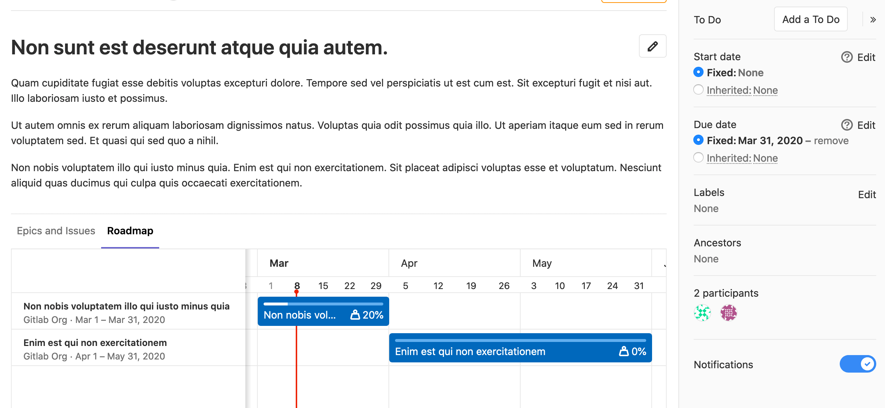



- Tier: Premium, Ultimate
- Offering: GitLab.com, GitLab Self-Managed, GitLab Dedicated



Epics in GitLab coordinate and track large initiatives by organizing work items into a work hierarchy.
Epics make complex projects manageable. They:

- Break down large features into smaller deliverables that add incremental value.
- Track the progress of related work items with scheduled start and end dates.
- Organize discussions and decisions about feature scope and requirements.
- Create hierarchical structures that connect tasks to strategic goals.
- Build visual roadmaps to monitor progress toward objectives.

Teams use epics to coordinate across multiple iterations and track progress toward long-term goals.

In the Ultimate tier, [nested epics](manage_epics.md#multi-level-child-epics) provide additional
structure through work hierarchies that align with agile frameworks.
Break down complex projects into more manageable child epics, which can further contain their own
sets of issues and tasks.
This nested structure helps maintain clarity and ensures all aspects of a project are covered without
losing sight of the overarching goals.

  See the video: <a href="https://www.youtube.com/watch?v=c0EwYYUZppw">GitLab Epics - Setting up your Organization with GitLab</a>.

<figure class="video-container">
  <iframe src="https://www.youtube-nocookie.com/embed/c0EwYYUZppw" frameborder="0" allowfullscreen> </iframe>
</figure>
<!-- Video published on 2023-10-30 -->

## Relationships between epics and other items

The possible relationships between epics and other items are:

- An epic is the parent of one or more issues.
- An epic is the parent of one or more [child epics](manage_epics.md#multi-level-child-epics). Ultimate only.
- An epic is [linked](linked_epics.md) to one or more task, objective, or key result.
  [The new look for epics](epic_work_items.md) must be enabled.

Example set of relationships:

```mermaid

%%{init: { "fontFamily": "GitLab Sans" }}%%
graph TD
    accTitle: Epics and issues
    accDescr: How issues and child epics relate to parent epics and lateral relationships to work items

    %% Main structure %%
    Parent_epic -->|contains| Issue1
    Parent_epic -->|contains| Child_epic
    Child_epic -->|contains| Issue2

    %% Additional work items and lateral relationships %%
    Issue1 -- contains --> Task1["Task"]
    Issue2 -- "blocked by" --> Objective1["Objective"]
    Task1 -- blocking --> KeyResult1["Key Result"]

    %% Work items linked to epics and issues %%
    Parent_epic -. related .- Objective1
    Child_epic -. "blocked by" .- KeyResult1

```

### Child issues from different group hierarchies



- [Introduced](https://gitlab.com/gitlab-org/gitlab/-/issues/371081) in GitLab 15.5 [with a flag](../../../administration/feature_flags.md) named `epic_issues_from_different_hierarchies`. Disabled by default.
- [Enabled on GitLab.com](https://gitlab.com/gitlab-org/gitlab/-/issues/373304) in GitLab 15.5.
- Feature flag `epic_issues_from_different_hierarchies` removed in GitLab 15.6.



You can add issues from a different group hierarchy to an epic.
To do it, paste the issue URL when
[adding an existing issue](manage_epics.md#add-an-existing-issue-to-an-epic).

## Roadmap in epics



- Tier: Ultimate
- Offering: GitLab.com, GitLab Self-Managed, GitLab Dedicated



If your epic contains one or more [child epics](manage_epics.md#multi-level-child-epics) that
have a start or due date, you can go to a [roadmap](../roadmap/_index.md)
of the child epics from the epic.

<!-- When epics as work items are generally available, the steps below should be the only ones here. -->

If [the new look for epics](epic_work_items.md) is enabled:

- On the **Child items** section header, select **More actions** () **> View on a roadmap**.

A roadmap filtered for the parent epic opens.

## Related topics

- [Manage epics](manage_epics.md) and multi-level child epics.
- Link [related epics](linked_epics.md) based on a type of relationship.
- Create workflows with [epic boards](epic_boards.md).
- [Turn on notifications](../../profile/notifications.md) for about epic events.
- [Add an emoji reaction](../../emoji_reactions.md) to an epic or its comments.
- Collaborate on an epic by posting comments in a [thread](../../discussions/_index.md).
- Use [health status](manage_epics.md#health-status) to track your progress.

<!-- ## Troubleshooting

Include any troubleshooting steps that you can foresee. If you know beforehand what issues
one might have when setting this up, or when something is changed, or on upgrading, it's
important to describe those, too. Think of things that may go wrong and include them here.
This is important to minimize requests for support, and to avoid doc comments with
questions that you know someone might ask.

Each scenario can be a third-level heading, for example `### Getting error message X`.
If you have none to add when creating a doc, leave this section in place
but commented out to help encourage others to add to it in the future. -->
