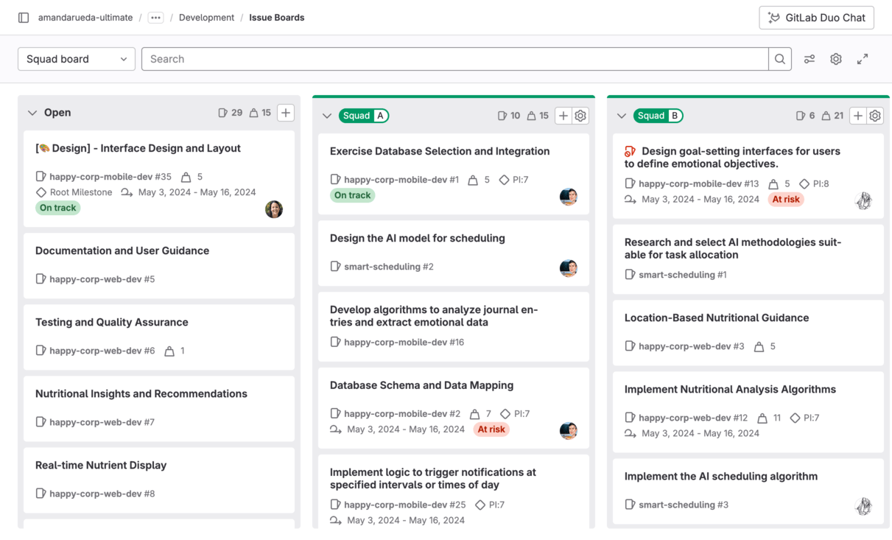
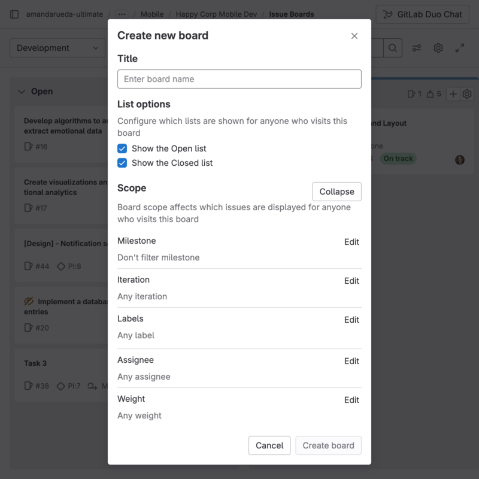
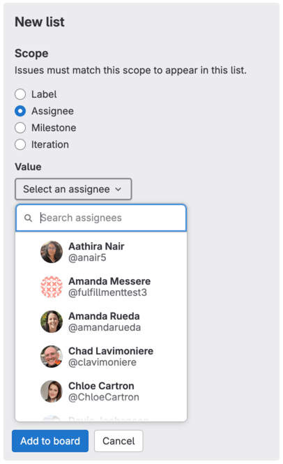
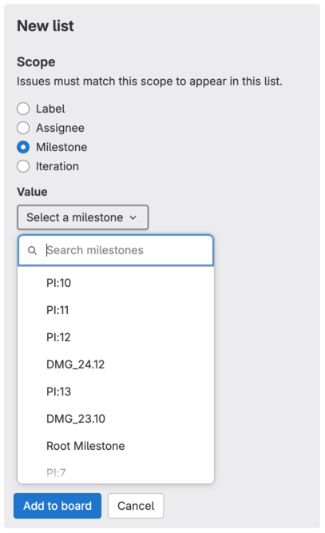
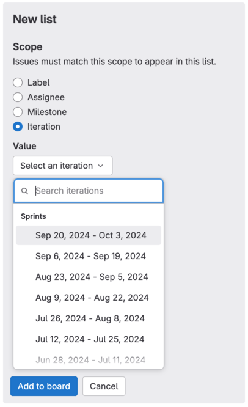
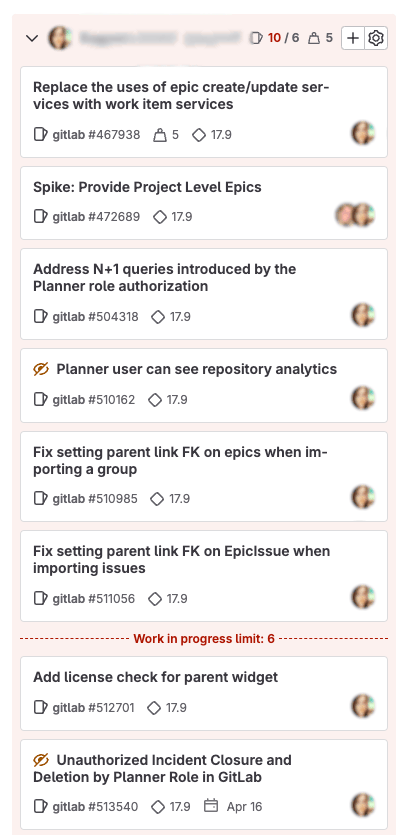
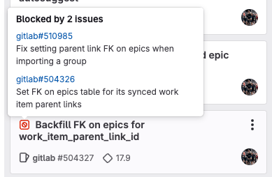
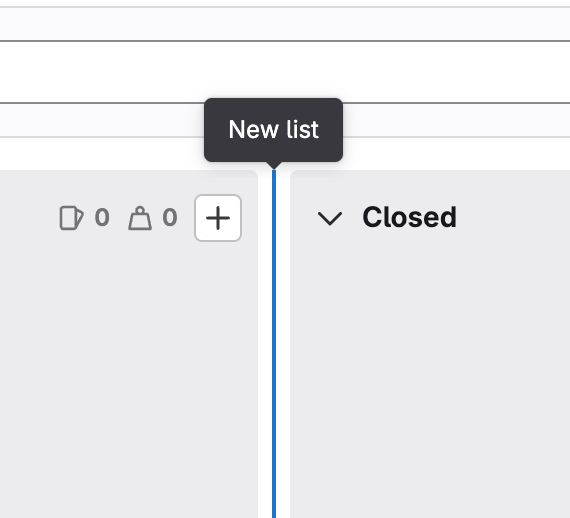



- Tier: Free, Premium, Ultimate
- Offering: GitLab.com, GitLab Self-Managed, GitLab Dedicated





- Milestones and iterations shown on issue cards [introduced](https://gitlab.com/gitlab-org/gitlab/-/issues/25758) in GitLab 16.11.
- Ability to delete the last board in a group or project [introduced](https://gitlab.com/gitlab-org/gitlab/-/issues/499579) in GitLab 17.6.
- Minimum role to manage issue boards [changed](https://gitlab.com/gitlab-org/gitlab/-/merge_requests/169256) from Reporter to Planner in GitLab 17.7.



Issue boards provide a visual way to manage and track work in GitLab.
Issue boards:

- Display issues as cards in customizable lists based on labels, milestones, or assignees.
- Track issues through different stages of your workflow.
- Support agile methodologies like Kanban and Scrum.
- Organize multiple boards for different teams and projects.
- Visualize workload and progress across your entire process.

Your issues appear as cards in vertical lists, organized by their assigned
[labels](labels.md), [milestones](#milestone-lists), [iterations](#iteration-lists), or [assignees](#assignee-lists).

Add metadata to your issues, then create the corresponding list for your existing issues.
When you're ready, you can drag your issue cards from one list to another.

Issue boards can power common frameworks like [Kanban](https://en.wikipedia.org/wiki/Kanban_(development)) and
[Scrum](https://en.wikipedia.org/wiki/Scrum_(software_development)).

To let your team members organize their own workflows, use
[multiple issue boards](#multiple-issue-boards). This allows creating multiple issue
boards in the same project.



Different issue board features are available in different [GitLab tiers](https://about.gitlab.com/pricing/):

| Tier     | Number of project issue boards | Number of [group issue boards](#group-issue-boards) | [Configurable issue boards](#configurable-issue-boards) | [Assignee lists](#assignee-lists) |
| -------- | ------------------------------ | --------------------------------------------------- | ------------------------------------------------------- | --------------------------------- |
| Free     | Multiple                       | 1                                                   |  No                                  |  No            |
| Premium  | Multiple                       | Multiple                                            |  Yes                                  |  Yes            |
| Ultimate | Multiple                       | Multiple                                            |  Yes                                  |  Yes            |

Read more about [GitLab Enterprise features for issue boards](#gitlab-enterprise-features-for-issue-boards).


<i class="fa fa-youtube-play youtube" aria-hidden="true"></i>
Watch a [video presentation](https://youtu.be/vjccjHI7aGI) of the issue board feature.
<!-- Video published on 2020-04-02 -->

## Multiple issue boards

Multiple issue boards allow for more than one issue board for:

- A project in all tiers
- A group in the Premium and Ultimate tier

Multiple issue boards are great for large projects with more than one team, in which a repository hosts
the code of multiple products and when you want to create boards to power different workflows across
the software development lifecycle.

Using the search box at the top of the menu, you can filter the listed boards.

When you have ten or more boards available, a **Recent** section is also shown in the menu, with
shortcuts to your last four visited boards.


When you're revisiting an issue board in a project or group with multiple boards,
GitLab automatically loads the last board you visited.

### Create an issue board

Prerequisites:

- You must have at least the Planner role for the project.

To create a new issue board:

1. In the upper-left corner of the issue board page, select the dropdown list with the current board name.
1. Select **Create new board**.
1. Enter the new board's name and select its scope: milestone, iteration, labels, assignee, or weight.
1. Select **Create board**

### Delete an issue board

Prerequisites:

- You must have at least the Planner role for the project or group where the board is saved.

To delete the open issue board:

1. In the upper-right corner of the issue board page, select **Configure board** ().
1. Select **Delete board**.
1. Select **Delete** to confirm.

If the board you've deleted was the last one, a new `Development` board is created.

## Issue boards use cases

You can tailor GitLab issue boards to your own preferred workflow.
For workflow-based documentation, see [Tutorials: Plan and track your work](../../tutorials/plan_and_track.md).

### Use cases for a single issue board

With the [GitLab Flow](https://about.gitlab.com/topics/version-control/what-is-gitlab-flow/) you can
discuss proposals in issues, label them, and organize and prioritize them with issue boards.

For example, let's consider this simplified development workflow:

1. You have a repository that hosts your application's codebase, and your team actively contributes code.
1. Your **backend** team starts working on a new implementation, gathers feedback and approval, and
   passes it over to the **frontend** team.
1. When frontend is complete, the new feature is deployed to a **staging** environment to be tested.
1. When successful, it's deployed to **production**.

If you have the labels **Backend**, **Frontend**, **Staging**, and
**Production**, and an issue board with a list for each, you can:

- Visualize the entire flow of implementations since the beginning of the development lifecycle
  until deployed to production.
- Prioritize the issues in a list by moving them vertically.
- Move issues between lists to organize them according to the labels you've set.
- Add multiple issues to lists in the board by selecting one or more existing issues.


### Scrum team

In a Scrum team, use [multiple issue boards](#multiple-issue-boards) so that each scrum team has their own board.
On the Scrum board, you can easily move issues through each
part of the process. For example: **To Do**, **Doing**, and **Done**.

### Quick assignments

To quickly assign issues to your team members:

1. Create [assignee lists](#assignee-lists) for each team member.
1. Drag an issue onto the team member's list.

## Issue board terminology

An **issue board** represents a unique view of your issues. It can have multiple lists with each
list consisting of issues represented by cards.

A **list** is a column on the issue board that displays issues matching certain attributes.
In addition to the default "Open" and "Closed" lists, each additional list shows issues matching
your chosen label, assignee, or milestone. On the top of each list you can see the number of issues
that belong to it. Types of lists include:

- **Open** (default): all open issues that do not belong to one of the other lists.
  Always appears as the leftmost list.
- **Closed** (default): all closed issues. Always appears as the rightmost list.
- **Label list**: all open issues for a label.
- [**Assignee list**](#assignee-lists): all open issues assigned to a user.
- [**Milestone list**](#milestone-lists): all open issues for a milestone.
- [**Iteration list**](#iteration-lists): all open issues for an iteration.

A **Card** is a box on a list, and it represents an issue. You can drag cards from one list to
another to change their label, assignee, or milestone. The information you can see on a
card includes:

- Issue title
- Associated labels
- Issue number
- Assignee
- Weight
- Milestone
- Iteration (in the Premium and Ultimate tier)
- Due date
- Time tracking estimate
- Health status

A **swimlane** is a horizontal grouping of issues on the issue board, for example by parent epic.

## Ordering issues in a list

Prerequisites:

- You must have at least the Planner role for the project.

When an issue is created, the system assigns a relative order value that is greater than the maximum value
of that issue's project or top-level group. This means the issue is at the bottom of any issue list that
it appears in.

When you visit a board, issues appear ordered in any list. You're able to change
that order by dragging the issues. The changed order is saved, so that anybody who visits the same
board later sees the reordering, with some exceptions.

Any time you drag and reorder the issue, its relative order value changes accordingly.
Then, any time that issue appears in any board, the ordering is done according to
the updated relative order value. If a user in your GitLab instance
drags issue `A` above issue `B`, the ordering is maintained when these two issues are subsequently
loaded in any board in the same instance.
This could be a different project board or a different group
board, for example.

This ordering also affects [issue lists](issues/sorting_issue_lists.md).
Changing the order in an issue board changes the ordering in an issue list,
and vice versa.

## Focus mode

In focus mode, the navigation UI is hidden, allowing you to focus on issues in the board.
To enable or disable focus mode, in the upper-right corner, select **Toggle focus mode** ().

## Group issue boards

Accessible at the group navigation level, a group issue board offers the same features as a project-level board.
It can display issues from all projects that fall under the group and its descendant subgroups.

Users on GitLab Free can use a single group issue board.

## GitLab Enterprise features for issue boards

GitLab issue boards are available on the GitLab Free tier, but some
advanced functionality is present in [higher tiers only](https://about.gitlab.com/pricing/).

### Configurable issue boards



- Tier: Premium, Ultimate
- Offering: GitLab.com, GitLab Self-Managed, GitLab Dedicated



An issue board can be associated with a [milestone](milestones/_index.md),
[labels](labels.md), assignee, weight, and current [iteration](../group/iterations/_index.md),
which automatically filter the board issues accordingly.
This allows you to create unique boards according to your team's need.



You can define the scope of your board when creating it or by selecting the **Configure board** () button.
After a milestone, iteration, assignee, or weight is assigned to an issue board, you can no longer
filter through these in the search bar. To do that, you need to remove the desired scope
(for example, milestone, assignee, or weight) from the issue board.

If you don't have editing permission in a board, you're still able to see the configuration by
selecting **Board configuration** ().

### Assignee lists



- Tier: Premium, Ultimate
- Offering: GitLab.com, GitLab Self-Managed, GitLab Dedicated



As in a regular list showing all issues with a chosen label, you can add
an assignee list that shows all issues assigned to a user.
You can have a board with both label lists and assignee lists.

Prerequisites:

- You must have at least the Planner role for the project.

To add an assignee list:

1. Select **New list**.
1. Select **Assignee**.
1. In the dropdown list, select a user.
1. Select **Add to board**.

Now that the assignee list is added, you can assign or unassign issues to that user
by [moving issues](#move-issues-and-lists) to and from an assignee list.
To remove an assignee list, just as with a label list, select the trash icon.



### Milestone lists



- Tier: Premium, Ultimate
- Offering: GitLab.com, GitLab Self-Managed, GitLab Dedicated



You can create milestone lists that filter issues by the assigned
milestone, giving you more freedom and visibility on the issue board.

Prerequisites:

- You must have at least the Planner role for the project.

To add a milestone list:

1. Select **New list**.
1. Select **Milestone**.
1. In the dropdown list, select a milestone.
1. Select **Add to board**.

Like the assignee lists, you're able to [drag issues](#move-issues-and-lists)
to and from a milestone list to manipulate the milestone of the dragged issues.
As in other list types, select the trash icon to remove a list.



### Iteration lists



- Tier: Premium, Ultimate
- Offering: GitLab.com, GitLab Self-Managed, GitLab Dedicated



You can create lists of issues in an iteration.

Prerequisites:

- You must have at least the Planner role for the project.

To add an iteration list:

1. Select **New list**.
1. Select **Iteration**.
1. In the dropdown list, select an iteration.
1. Select **Add to board**.

Like the milestone lists, you're able to [drag issues](#move-issues-and-lists)
to and from a iteration list to manipulate the iteration of the dragged issues.



### Group issues in swimlanes



- Tier: Premium, Ultimate
- Offering: GitLab.com, GitLab Self-Managed, GitLab Dedicated



With swimlanes you can visualize issues grouped by epic.
Your issue board keeps all the other features, but with a different visual organization of issues.
This feature is available both at the project and group level.

Prerequisites:

- You must have at least the Planner role for the project.

To group issues by epic in an issue board:

1. Select **View options** ().
1. Select **Epic swimlanes**.


You can then [edit](#edit-an-issue) issues without leaving this view and [drag](#move-issues-and-lists)
them to change their position and epic assignment:

- To reorder an issue, drag it to the new position in a list.
- To assign an issue to another epic, drag it to the epic's horizontal lane.
- To remove an issue from an epic, drag it to the **Issues with no epic assigned** lane.
- To move an issue to another epic _and_ another list, at the same time, drag the issue diagonally.


### Sum of issue weights



- Tier: Premium, Ultimate
- Offering: GitLab.com, GitLab Self-Managed, GitLab Dedicated



The top of each list indicates the sum of issue weights for the issues that
belong to that list. This is useful when using boards for capacity allocation,
especially in combination with [assignee lists](#assignee-lists).


### Work in progress limits



- Tier: Premium, Ultimate
- Offering: GitLab.com, GitLab Self-Managed, GitLab Dedicated



You can set a work in progress (WIP) limit for each issue list on an issue board. When a limit is
set, the list's header shows the number of issues in the list and the soft limit of issues. A line in the list separates items within the limit from those in excess of the limit.
You cannot set a WIP limit on the default lists (**Open** and **Closed**).

Examples:

- When you have a list with four issues and a limit of five, the header shows **4/5**.
  If you exceed the limit, the current number of issues is shown in red.
- You have a list with five issues with a limit of five. When you move another issue to that list,
  the list's header displays **6/5**, with the six shown in red. The work in progress line is shown before the sixth issue.



Prerequisites:

- You must have at least the Planner role for the project.

To set a WIP limit for a list, in an issue board:

1. On the top of the list you want to edit, select **Edit list settings** ().
   The list settings sidebar opens on the right.
1. Next to **Work in progress limit**, select **Edit**.
1. Enter the maximum number of issues.
1. Press <kbd>Enter</kbd> to save.

### Blocked issues



- Tier: Premium, Ultimate
- Offering: GitLab.com, GitLab Self-Managed, GitLab Dedicated



If an issue is [blocked by another issue](issues/related_issues.md#blocking-issues), an icon appears next to its title to indicate its blocked
status.

When you hover over the blocked icon (), a detailed information popover is displayed.



## Actions you can take on an issue board

- [Edit an issue](#edit-an-issue).
- [Create a new list](#create-a-new-list).
- [Remove an existing list](#remove-a-list).
- [Remove an issue from a list](#remove-an-issue-from-a-list).
- [Filter issues](#filter-issues) that appear across your issue board.
- [Move issues and lists](#move-issues-and-lists).
- Drag and reorder the lists.
- Change issue labels (by dragging an issue between lists).
- Close an issue (by dragging it to the **Closed** list).

### Edit an issue

You can edit an issue without leaving the board view.
To open the right sidebar, select an issue card (not its title).

Prerequisites:

- You must have at least the Planner role for the project.

You can edit the following issue attributes in the right sidebar:

- Assignees
- Confidentiality
- Due date
- [Epic](../group/epics/_index.md)
- [Health status](issues/managing_issues.md#health-status)
- [Iteration](../group/iterations/_index.md)
- Labels
- Milestone
- Notifications setting
- Title
- [Weight](issues/issue_weight.md)
- Time tracking

<!-- When issues_list_drawer feature flag is removed, use the info below
and in issues/managing_issues.md#open-issues-in-a-drawer to update the main topic above -->

If your administrator enabled the [issue drawer](issues/managing_issues.md#open-issues-in-a-drawer),
when you select an issue card from the issue board, the issue opens in a drawer.
There, you can edit all the fields, including the description, comments, or related items.

### Create a new list



- Creating a list between existing lists [introduced](https://gitlab.com/gitlab-org/gitlab/-/issues/462515) in GitLab 17.5.



You can create a new list between two existing lists or at the right of an issue board.

To create a new list between two lists:

1. On the left sidebar, select **Search or go to** and find your project.
1. Select **Plan > Issue boards**.
1. Hover or move keyboard focus between two lists.
1. Select **New list**.
   The new list panel opens.

   

1. Choose the label, user, milestone, or iteration to base the new list on.
1. Select **Add to board**.

The new list is inserted in the same position on the board as the new list panel.

To move and reorder lists, drag them around.

Alternatively, you can select the **New list** at the right end of the board.
The new list is inserted at the right end of the lists, before **Closed**.

### Remove a list

Removing a list doesn't have any effect on issues and labels, as it's just the
list view that's removed. You can always create it again later if you need.

Prerequisites:

- You must have at least the Planner role for the project.

To remove a list from an issue board:

1. On the top of the list you want to remove, select **Edit list settings** ().
   The list settings sidebar opens on the right.
1. Select **Remove list**.
1. On the confirmation dialog, select **Remove list** again.

### Add issues to a list

Prerequisites:

- You must have at least the Planner role for the project.

If your board is scoped to one or more attributes, go to the issues you want to add and apply the
same attributes as your board scope.

For example, to add an issue to a list scoped to the `Doing` label, in a group issue board:

1. Go to an issue in the group or one of the subgroups or projects.
1. Add the `Doing` label.

The issue should now show in the `Doing` list on your issue board.

### Remove an issue from a list

When an issue should no longer belong to a list, you can remove it.

Prerequisites:

- You must have at least the Planner role for the project.

The steps depend on the scope of the list:

1. To open the right sidebar, select the issue card.
1. Remove what's keeping the issue in the list.
   If it's a label list, remove the label. If it's an [assignee list](#assignee-lists), unassign the user.

### Filter issues

You can use the filters on top of your issue board to show only
the results you want. It's similar to the filtering used in the [issue tracker](issues/_index.md).

Prerequisites:

- You must have at least the Planner role for the project.

You can filter by the following:

- Assignee
- Author
- [Epic](../group/epics/_index.md)
- [Iteration](../group/iterations/_index.md)
- Label
- Milestone
- My Reaction
- Release
- Type (issue/incident)
- [Weight](issues/issue_weight.md)

#### Filtering issues in a group board

When [filtering issues](#filter-issues) in a **group** board, keep this behavior in mind:

- Milestones: you can filter by the milestones belonging to the group and its descendant groups.
- Labels: you can only filter by the labels belonging to the group but not its descendant groups.

When you edit issues individually using the right sidebar, you can additionally select the
milestones and labels from the **project** that the issue is from.

### Move issues and lists

You can move issues and lists by dragging them.

Prerequisites:

- You must have at least the Planner role for a project in GitLab.

To move an issue, select the issue card and drag it to another position in its current list or
into a different list. Learn about possible effects in [Dragging issues between lists](#dragging-issues-between-lists).

To move a list, select its top bar, and drag it horizontally.
You can't move the **Open** and **Closed** lists, but you can hide them when editing an issue board.

#### Move an issue to the start of the list



- [Introduced](https://gitlab.com/gitlab-org/gitlab/-/issues/367473) in GitLab 15.4.



You can move issues to the top of the list with a menu shortcut.

Your issue is moved to the top of the list even if other issues are hidden by a filter.

Prerequisites:

- You must at least have the Planner role for the project.

To move an issue to the start of the list:

1. In an issue board, hover over the card of the issue you want to move.
1. Select **Card options** (), then **Move to start of list**.

#### Move an issue to the end of the list



- [Introduced](https://gitlab.com/gitlab-org/gitlab/-/issues/367473) in GitLab 15.4.



You can move issues to the bottom of the list with a menu shortcut.

Your issue is moved to the bottom of the list even if other issues are hidden by a filter.

Prerequisites:

- You must at least have the Planner role for the project.

To move an issue to the end of the list:

1. In an issue board, hover over the card of the issue you want to move.
1. Select **Card options** (), then **Move to end of list**.

#### Dragging issues between lists

To move an issue to another list, select the issue card and drag it onto that list.

When you drag issues between lists, the result is different depending on the source list
and the target list.

|                              | To Open        | To Closed   | To label B list                | To assignee Bob list          |
| ---------------------------- | -------------- | ----------- | ------------------------------ | ----------------------------- |
| **From Open**                | -              | Close issue | Add label B                    | Assign Bob                    |
| **From Closed**              | Reopen issue   | -           | Reopen issue and add label B   | Reopen issue and assign Bob   |
| **From label A list**        | Remove label A | Close issue | Remove label A and add label B | Assign Bob                    |
| **From assignee Alice list** | Unassign Alice | Close issue | Add label B                    | Unassign Alice and assign Bob |

## Tips

A few things to remember:

- Moving an issue between lists removes the label from the list it came from
  and adds the label from the list it goes to.
- An issue can exist in multiple lists if it has more than one label.
- Lists are populated with issues automatically if the issues are labeled.
- Selecting the issue title inside a card takes you to that issue.
- Selecting a label inside a card quickly filters the entire issue board
  and show only the issues from all lists that have that label.
- For performance and visibility reasons, each list shows the first 20 issues
  by default. If you have more than 20 issues, start scrolling down and the next
  20 appear.

## Troubleshooting issue boards

### `There was a problem fetching users` on group issue board when filtering by Author or Assignee

If you get a banner with `There was a problem fetching users` error when filtering by author or assignee on
group issue board, make sure that you are added as a member to the current group.
Non-members do not have permission to list group members when filtering by author or assignee on issue boards.

To fix this error, you should add all of your users to the top-level group with at least the Guest role.

### Use Rails console to fix issue boards not loading and timing out

If you see issue board not loading and timing out in UI, use Rails console to call the Issue Rebalancing service to fix it:

1. [Start a Rails console session](../../administration/operations/rails_console.md#starting-a-rails-console-session).
1. Run these commands:

   ```ruby
   p = Project.find_by_full_path('<username-or-group>/<project-name>')

   Issues::RelativePositionRebalancingService.new(p.root_namespace.all_projects).execute
   ```

1. To exit the Rails console, type `quit`.
